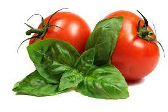
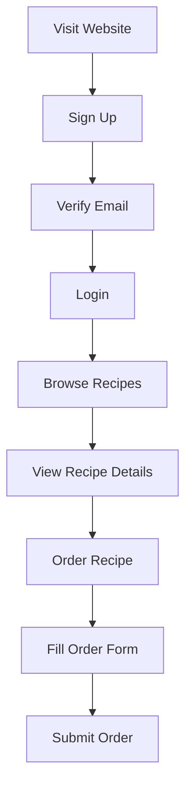
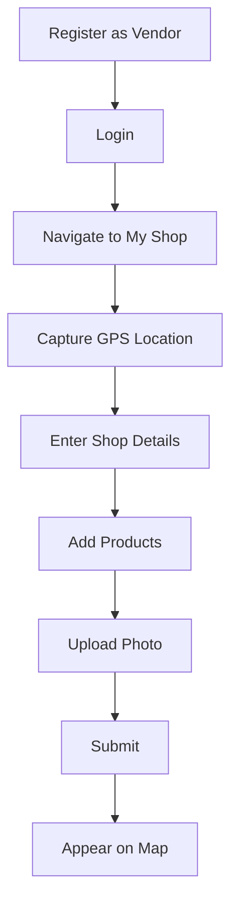
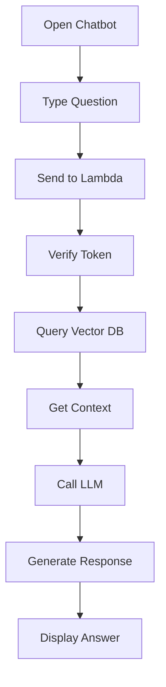

# 🥬 Vendor Veggie & Vittles

<div align="center">
  
  
  ### A Complete Local Food Ecosystem Platform
  
  [](http://d3ddllzhff5q42.cloudfront.net)
  [](https://www.credly.com/badges/6f76568d-0de8-49c5-bea0-43a5b6e7e25d/public_url)
  
</div>

---

## 📋 Table of Contents

- [Overview](#-overview)
- [Key Features](#-key-features)
- [Architecture](#-architecture)
- [Tech Stack](#-tech-stack)
- [Getting Started](#-getting-started)
- [Deployment](#-deployment)
- [Project Structure](#-project-structure)
- [User Flows](#-user-flows)
- [Contributing](#-contributing)
- [Contact](#-contact)

---

## 🌟 Overview

**Vendor Veggie & Vittles** bridges the gap between local vegetable vendors, home cooks, and food enthusiasts. It creates a thriving ecosystem where fresh produce meets culinary creativity, empowering communities to discover, cook, and support local businesses.

### 🎯 Problem Statement

- **Vendors**: Small vegetable vendors lack digital presence
- **Home Cooks**: Difficulty finding fresh local ingredients and authentic recipes
- **Recipe Creators**: No platform to monetize culinary skills
- **Customers**: Hard to locate nearby vendors and order home-cooked meals

### 💡 Our Solution

An integrated platform that:
- 📍 Maps local vendors with real-time GPS location
- 📖 Hosts community-driven South Indian recipe collections
- 🤖 Provides AI assistance connecting recipes, ingredients, and vendors
- 💰 Enables recipe creators to monetize their dishes
- 📦 Facilitates complete order management

---

## ✨ Key Features

### 🔐 Authentication & User Management
- Multi-role authentication (Users, Vendors, Admin)
- Email verification with Firebase Authentication
- Password reset and secure session management

### 🍲 Recipe Platform
- **Browse & Search**: Category filtering, real-time search
- **Rich Media**: High-quality images, YouTube tutorial integration
- **Upload & Edit**: Share recipes with detailed instructions
- **Monetization**: "Order This Recipe" feature for prepared dishes

### 📦 Order Management System
- Two-sided dashboard (orders placed vs. received)
- Status tracking (Pending/Accepted/Rejected)
- Accept/Reject controls for recipe creators
- Direct customer-creator communication

### 🗺️ Interactive Vendor Map
- Google Maps integration with color-coded markers
- Vendor profiles with contact info, products, and photos
- GPS location capture for easy vendor registration
- Search vendors by product or location

### 🤖 AI-Powered Chatbot
- **RAG Architecture**: Retrieval-Augmented Generation for accuracy
- **Multi-domain knowledge**: Recipes, vendors, orders
- **Context-aware**: Remembers conversation history
- **Smart connections**: Links ingredients to nearby vendors

### 👨‍💼 Admin Dashboard
- User management and monitoring
- Content moderation (recipe deletion)
- Platform oversight

---

## 🏗️ Architecture

### High-Level Architecture
```
┌─────────────────────────────────────────────────────────────────┐
│                         USER BROWSER                            │
│                    (CloudFront CDN - HTTPS)                     │
└────────────────┬────────────────────────────────────────────────┘
                 │
                 ├──────────────────┐
                 │                  │
        ┌────────▼────────┐  ┌─────▼──────────────┐
        │   S3 Bucket     │  │  Lambda Function   │
        │  (Frontend)     │  │   (Chatbot API)    │
        │  - HTML/CSS/JS  │  │  - Container Image │
        │  - Bootstrap    │  │  - Python 3.12     │
        │  - Images       │  │  - LangChain       │
        └─────────────────┘  └──────┬─────────────┘
                                    │
                 ┌──────────────────┼──────────────────┐
                 │                  │                  │
        ┌────────▼────────┐  ┌──────▼──────┐  ┌──────▼──────────┐
        │   Firebase      │  │     ECR     │  │   OpenRouter    │
        │  - Firestore    │  │  Container  │  │   (LLM API)     │
        │  - Auth         │  │  Registry   │  │  GPT-3.5-turbo  │
        │  - Recipes      │  └─────────────┘  └─────────────────┘
        │  - Vendors      │
        │  - Orders       │
        └─────────────────┘
```

### Request Flow
```
User Browser → CloudFront (HTTPS) → S3 (Static Files)
     │
     └─→ Lambda Function → Vector DB → OpenRouter LLM → Response
              │
              └─→ Firebase Auth & Firestore
```

---

## 🛠️ Tech Stack

### Frontend
- **HTML5/CSS3** - Semantic markup and responsive design
- **JavaScript (ES6+)** - Vanilla JS for interactivity
- **Bootstrap 4.3.1** - UI components
- **Firebase SDK** - Authentication and Firestore
- **Google Maps API** - Vendor mapping

### Backend
- **Python 3.12** - Core backend language
- **AWS Lambda** - Serverless compute (Container Image)
- **LangChain** - RAG framework
- **ChromaDB** - Vector database
- **HuggingFace** - Sentence embeddings
- **OpenRouter API** - LLM provider (GPT-3.5-turbo)
- **Firebase Admin SDK** - Server-side operations

### Infrastructure
- **AWS S3** - Static hosting
- **AWS CloudFront** - CDN for HTTPS
- **AWS ECR** - Docker registry
- **Firebase Firestore** - NoSQL database
- **Docker** - Containerization

---

## 🚀 Getting Started

### Prerequisites

- **Python 3.12** | **Docker Desktop** | **AWS Account** | **Firebase Project**
- **OpenRouter API Key** | **Google Maps API Key**

### Local Development Setup

#### 1️⃣ Clone Repository
```bash
git clone https://github.com/yourusername/vendor-veggie-vittles.git
cd vendor-veggie-vittles
```

#### 2️⃣ Configure Firebase

Edit `index.html`, `home.html`, `admin.html` with your Firebase config:
```javascript
const firebaseConfig = {
    apiKey: "YOUR_API_KEY",
    authDomain: "YOUR_PROJECT.firebaseapp.com",
    projectId: "YOUR_PROJECT_ID",
    storageBucket: "YOUR_PROJECT.appspot.com",
    messagingSenderId: "YOUR_SENDER_ID",
    appId: "YOUR_APP_ID"
};
```

#### 3️⃣ Backend Setup
```bash
cd chatbot_backend

# Create virtual environment
python -m venv venv
source venv/bin/activate  # On Windows: venv\Scripts\activate

# Install dependencies
pip install -r requirements.txt
```

Create `.env` file:
```env
OPENROUTER_API_KEY=your_key
FIREBASE_PROJECT_ID=your_project_id
GOOGLE_APPLICATION_CREDENTIALS=firebase-credentials.json
```

Add `firebase-credentials.json` (download from Firebase Console → Project Settings → Service Accounts)

---

## 📦 Deployment

### 🌐 Frontend (S3 + CloudFront)

#### Step 1: Create S3 Bucket
```bash
# Create bucket
aws s3 mb s3://your-bucket-name --region us-east-1

# Or use AWS Console: S3 → Create Bucket
# ⚠️ Uncheck "Block all public access"
```

#### Step 2: Enable Static Hosting
1. Bucket → Properties → Static website hosting → Enable
2. Index document: `index.html`
3. Copy **Bucket Website Endpoint URL**

#### Step 3: Set Bucket Policy
Permissions → Bucket Policy:
```json
{
  "Version": "2012-10-17",
  "Statement": [{
    "Sid": "PublicReadGetObject",
    "Effect": "Allow",
    "Principal": "*",
    "Action": "s3:GetObject",
    "Resource": "arn:aws:s3:::YOUR_BUCKET_NAME/*"
  }]
}
```

#### Step 4: Upload Files
```bash
aws s3 sync . s3://your-bucket-name/ --exclude "chatbot_backend/*"
```

#### Step 5: Setup CloudFront
1. CloudFront → Create Distribution
2. Origin domain: Paste S3 website endpoint
3. Origin protocol: **HTTP only**
4. Viewer protocol: **Redirect HTTP to HTTPS**
5. Create → Wait 15-20 minutes → Copy CloudFront URL

---

### 🤖 Backend (Lambda Container)

#### Step 1: Build Docker Image
```bash
cd chatbot_backend
docker buildx build --platform linux/amd64 --provenance=false -t recipe-chatbot-lambda .
```

#### Step 2: Push to ECR
```bash
# Create ECR repository
aws ecr create-repository --repository-name recipe-chatbot-lambda-repo --region us-east-1

# Login to ECR
aws ecr get-login-password --region us-east-1 | docker login --username AWS --password-stdin YOUR_ACCOUNT_ID.dkr.ecr.us-east-1.amazonaws.com

# Tag image
docker tag recipe-chatbot-lambda:latest YOUR_ACCOUNT_ID.dkr.ecr.us-east-1.amazonaws.com/recipe-chatbot-lambda-repo:latest

# Push image
docker push YOUR_ACCOUNT_ID.dkr.ecr.us-east-1.amazonaws.com/recipe-chatbot-lambda-repo:latest
```

#### Step 3: Create Lambda Function
1. Lambda → Create function → **Container image**
2. Function name: `RecipeAppChatbot`
3. Browse images → Select your ECR image
4. Create function

#### Step 4: Configure Lambda
**Environment Variables:**
```
OPENROUTER_API_KEY=your_key
GOOGLE_APPLICATION_CREDENTIALS=firebase-credentials.json
FIREBASE_PROJECT_ID=your_project_id
```

**Settings:**
- Memory: 1024 MB
- Timeout: 1 min

**Function URL:**
- Create function URL → Auth: NONE → Enable CORS
- Allow origin: `*` | Methods: POST, OPTIONS | Headers: Content-Type, Authorization
- Copy Function URL

---

### 🔗 Connect Frontend to Backend

Update `script.js`:
```javascript
let CHAT_ENDPOINT = 'https://YOUR_LAMBDA_URL.lambda-url.us-east-1.on.aws/';
```

Re-upload to S3:
```bash
aws s3 cp script.js s3://your-bucket-name/script.js
```

Invalidate CloudFront cache:
```bash
aws cloudfront create-invalidation --distribution-id YOUR_ID --paths "/*"
```

---

## 📁 Project Structure
```
vendor-veggie-vittles/
│
├── 📄 index.html              # Login/Signup page
├── 📄 home.html               # Main application
├── 📄 admin.html              # Admin dashboard
├── 📄 style.css               # Styles
├── 📄 script.js               # Frontend logic
│
├── 📁 images/                 # Assets
├── 📁 bootstrap-4.3.1-dist/   # Bootstrap
│
├── 📁 chatbot_backend/        # Lambda backend
│   ├── 📄 app.py              # Lambda handler
│   ├── 📄 requirements.txt    # Dependencies
│   ├── 📄 Dockerfile          # Container config
│   ├── 📄 .env                # Environment vars
│   └── 📄 firebase-credentials.json
│
└── 📄 README.md
```

---

## 👥 User Flows

### New User Registration & Recipe Order


### Vendor Shop Setup


### Chatbot Interaction


---

## 🗄️ Database Schema

### Firebase Firestore Collections
```
users/
  └── {userId}
      ├── name: string
      ├── email: string
      ├── userType: "user" | "vendor"
      └── createdAt: timestamp

recipes/
  └── {recipeId}
      ├── title: string
      ├── category: "vegetarian" | "dessert" | "nonVegetarian"
      ├── ingredients: array
      ├── method: array
      ├── uploaderId: string
      ├── uploaderName: string
      └── imageBase64: string

vendors/
  └── {vendorId}
      ├── vendorName: string
      ├── lat: number
      ├── lng: number
      ├── products: array
      ├── contact: string
      └── imageBase64: string

orders/
  └── {orderId}
      ├── recipeId: string
      ├── recipeName: string
      ├── customerId: string
      ├── customerPhone: string
      ├── customerAddress: string
      ├── creatorId: string
      ├── creatorName: string
      ├── status: "pending" | "accepted" | "rejected"
      └── timestamp: timestamp
```

---

## 🤝 Contributing

Contributions welcome! Here's how:

1. Fork the repository
2. Create feature branch: `git checkout -b feature/AmazingFeature`
3. Commit changes: `git commit -m 'Add AmazingFeature'`
4. Push to branch: `git push origin feature/AmazingFeature`
5. Open Pull Request

---

## 📝 License

This project is licensed under the MIT License - see [LICENSE](LICENSE) for details.

---

## 👨‍💻 Contact

**Your Name**  
📧 Email: your.email@example.com  
🔗 LinkedIn: [your-linkedin](https://linkedin.com/in/your-profile)  
🐙 GitHub: [yourusername](https://github.com/yourusername)

**Project Link:** [https://github.com/yourusername/vendor-veggie-vittles](https://github.com/yourusername/vendor-veggie-vittles)

---

## 🙏 Acknowledgments

- Firebase for authentication and database
- AWS for cloud infrastructure
- OpenRouter for LLM access
- LangChain for RAG framework
- Bootstrap for UI components

---

<div align="center">
  
  **⭐ Star this repo if you found it helpful!**
  
  Made with ❤️ for local food communities
  
</div>
